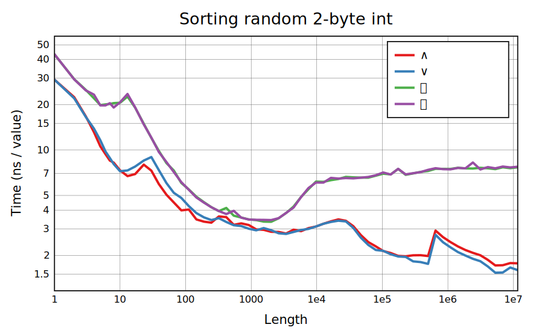

# Array language benchmarks

This benchmark suite is used as a reference for BQN development. It has precise within-language benchmarks and a finicky (lots of errors) [cross-language interface](measure/cross) to BQN, Dyalog APL, and J.

There are benchmarks for most primitives that have significant performance considerations, mostly focused on rank-1 numeric arrays at the moment.

[BQN result graphs with commentary here](https://mlochbaum.github.io/bencharray/pages/summary.html).

To use:

    $ ./benchmark.bqn help       # See options
    $ ./benchmark.bqn list       # See functions that can be benchmarked
    $ ./benchmark.bqn all arith  # Record and plot arithmetic benchmarks

