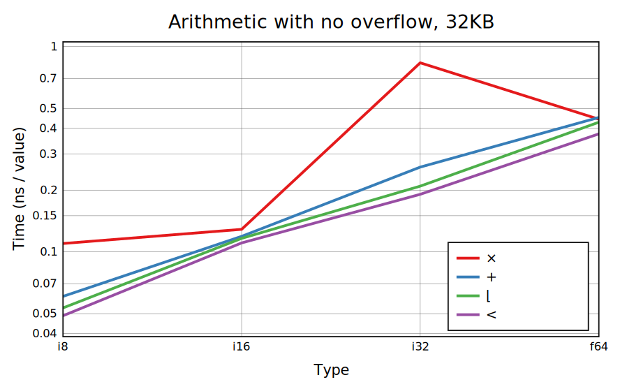

# Array language benchmarks

In-progress benchmark suite for array languages, currently targetting BQN only.

To use:

    $ ./benchmark.bqn help       # See options
    $ ./benchmark.bqn list       # See functions that can be benchmarked
    $ ./benchmark.bqn all arith  # Record and plot arithmetic benchmarks

